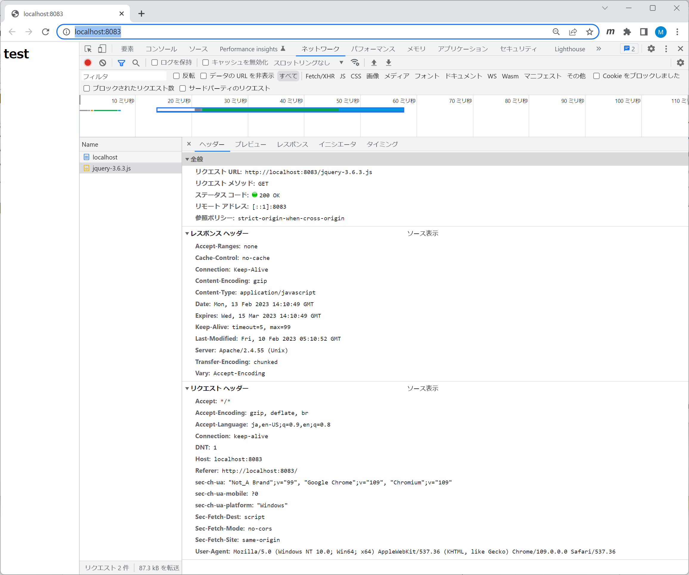
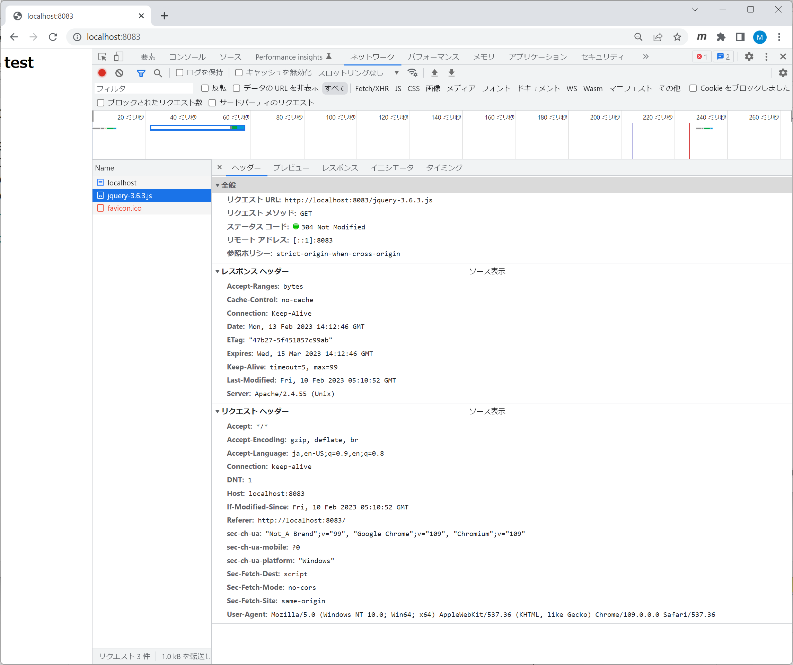

# apacheのバージョン

```shell
root@4e26083ca588:/usr/local/apache2# httpd -v
Server version: Apache/2.4.55 (Unix)
Server built:   Feb  9 2023 04:27:48
```

# 初期起動時のヘッダ内容



以下のヘッダが**レスポンス**される。
- Cache-Control: no-cache
- Expires: 一年後の日時
- Last-Modifed: ファイル更新日時(**日時Ａ**)
- Contents-Encoding: gzip

# 2回目起動時のヘッダ内容



以下のヘッダが**リクエスト**に追加される。
- If-Modified-Since: **日時Ａ**

以下のヘッダが**レスポンス**される。
- Cache-Control: no-cache
- Expires: 一年後の日時
- ETag: ファイルエンティティのタグ
- Last-Modifed: ファイル更新日時

# Apacheの設定
httpd.confの内容の抜粋です。

## FileETagとCache-Control
apacheのstaticファイル全体に対して、FileETagとCache-Controlの設定を追加する。

```xml
<Directory "/usr/local/apache2/htdocs">
    #
    # Possible values for the Options directive are "None", "All",
    # or any combination of:
    #   Indexes Includes FollowSymLinks SymLinksifOwnerMatch ExecCGI MultiViews
    #
    # Note that "MultiViews" must be named *explicitly* --- "Options All"
    # doesn't give it to you.
    #
    # The Options directive is both complicated and important.  Please see
    # http://httpd.apache.org/docs/2.4/mod/core.html#options
    # for more information.
    #
    Options Indexes FollowSymLinks

    #
    # AllowOverride controls what directives may be placed in .htaccess files.
    # It can be "All", "None", or any combination of the keywords:
    #   AllowOverride FileInfo AuthConfig Limit
    #
    AllowOverride None

    #
    # Controls who can get stuff from this server.
    #
    Require all granted

    #
    # Add Etag
    #
    FileETag MTime Size

    #
    # Add Cache-Control: no-cache
    #
    Header set Cache-Control no-cache
</Directory>
```

## キャッシュ有効期限の設定
クライアントキャッシュの有効期限設定は、Cache-Control: no-cacheを指定して常にキャッシュの有効性を確認する戦略の場合は、なくても問題ない。

```xml
<IfModule mod_expires.c>
  ExpiresActive On
  ExpiresDefault "access plus 1 month"
</IfModule>
```

## gzip圧縮の設定
```xml
<IfModule mod_deflate.c>
    DeflateCompressionLevel 9
    <IfModule mod_filter.c>
        FilterDeclare COMPRESS
        FilterProvider COMPRESS DEFLATE "%{CONTENT_TYPE} =~ m#^text/#i"
        FilterProvider COMPRESS DEFLATE "%{CONTENT_TYPE} =~ m#^application/(atom\+xml|javascript|json|rss\+xml|xml|xhtml\+xml)#i"
        FilterProvider COMPRESS DEFLATE "%{CONTENT_TYPE} =~ m#^image/(svg\+xml|vnd\.microsoft\.icon)#i"
        FilterChain COMPRESS
        FilterProtocol COMPRESS DEFLATE change=yes;byteranges=no
    </IfModule>
</IfModule>
```
